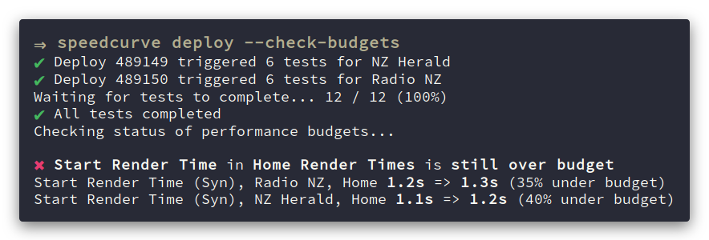

# SpeedCurve CLI

### 🍩 Official SpeedCurve CLI and Node.js API.



[](https://circleci.com/gh/SpeedCurve-Metrics/speedcurve-cli)
[](https://coveralls.io/github/SpeedCurve-Metrics/speedcurve-cli)

This package attempts to be a user-friendly wrapper around the SpeedCurve API. It currently supports:

* Triggering deploys
* Monitoring the status of deploys
* Getting the status of performance budgets
* Fetching synthetic test data
* Listing sites in an account
* JSON output for easy integration into build pipelines

## Installation

The recommended installation method for the CLI is via npm:

```
npm install -g speedcurve
```

To use the Node.js API you should install it as a dependency of your project:

```
npm install --save speedcurve
```

> Note that [Node.js](https://nodejs.org/) version 8 or higher is required.

## Basic usage

The `speedcurve` CLI interacts with the SpeedCurve API using your [SpeedCurve API key](https://support.speedcurve.com/apis/synthetic-api). This key can either be set as the `SPEEDCURVE_API_KEY` environment variable, e.g. `SPEEDCURVE_API_KEY=xxx speedcurve deploy` or can be specified using the `--key` flag e.g. `speedcurve deploy --key=xxx`.

See `speedcurve --help` for a list of all commands and options.

## Available commands

### `speedcurve deploy`

Create a deploy and trigger testing for one or more sites.

```
# Trigger testing for all sites
speedcurve deploy
Requesting deploys for 3 sites...
✔ Deploy 481509 triggered 6 tests for Stuff
✔ Deploy 481513 triggered 6 tests for Radio NZ
✔ Deploy 481511 triggered 6 tests for NZ Herald

# Optionally add a short description and longer detail about the deploy
speedcurve deploy --note 'v2.11.8' --detail 'Inline critical CSS, bootstrap app on DOMContentLoaded'

# Specify which site(s) to trigger testing for. Sites can be specified by name or ID
speedcurve deploy --site 1043801 --site 'BBC News'

# Specify which URL(s) to trigger testing for. URLs must be specified by ID
speedcurve deploy --url 110912

# Wait until all tests have completed before exiting
speedcurve deploy --wait

# Monitor the status of performance budgets
# Exits with a non-zero status if any budgets are over their threshold
speedcurve deploy --check-budgets
```

### `speedcurve deploy-status <deployId>`

Get the status of a deploy.

```
# Human-readable output
speedcurve deploy-status 472470
✔ Deploy complete. 36 tests completed.

# JSON output
speedcurve deploy-status --json 472470
```

### `speedcurve list-sites`

List all of the sites in a team. Useful for finding the ID of a site to deploy.

```
# Human-readable output
speedcurve list-sites

# JSON output
speedcurve list-sites --json
```

### `speedcurve tests`

Fetch synthetic test results as JSON for a site and all of its URLs.

```
# Get test results for all URLs in a site. Sites can be specified by name or ID
speedcurve tests --site 1043801

# Specify which URL(s) to get test resuts for. URLs can be specified by label or ID
speedcurve tests --site 1043801 --url 184629 --url 'Home'

# Control how many days of data to fetch, and filter to specific regions or browsers
speedcurve tests --site 'BBC News' --days 7 --region ap-southeast-2 --browser chrome
```

### `speedcurve budgets`

Get the status of all synthetic performance budgets.

```
# Human-readable output
speedcurve budgets
✔ Start Render Time in Article Render Times is under budget
Start Render Time (Syn), Radio NZ, Article is currently 1.1s (45% under budget)
Start Render Time (Syn), Stuff, Article is currently 1.5s (25% under budget)
Start Render Time (Syn), NZ Herald, Article is currently 2s (0% under budget)

✖ Start Render Time in Home Render Times is over budget
Start Render Time (Syn), Radio NZ, Home is currently 4.9s (145% over budget)
Start Render Time (Syn), Stuff, Home is currently 1.7s (15% under budget)
Start Render Time (Syn), NZ Herald, Home is currently 1s (50% under budget)

# JSON output
speedcurve budgets --json
```

### `speedcurve create-url` and `update-url`

Create a new URL within an existing site, or update an existing URL.

```
# Create a new URL. Sites can be specified by name or ID
speedcurve create-url --site 'BBC News' --url 'https://www.bbc.com/news' --label 'Home'
✔ URL 395928 was created

# Update an existing URL
speedcurve update-url --urlId 395928 --label 'Index'
✔ URL 395928 was updated
```

## Node.js API documentation

See [the API reference](https://speedcurve-metrics.github.io/speedcurve-cli/).

## Contributing

Pull requests are welcome! Please read [CONTRIBUTING.md](.github/CONTRIBUTING.md) first.
